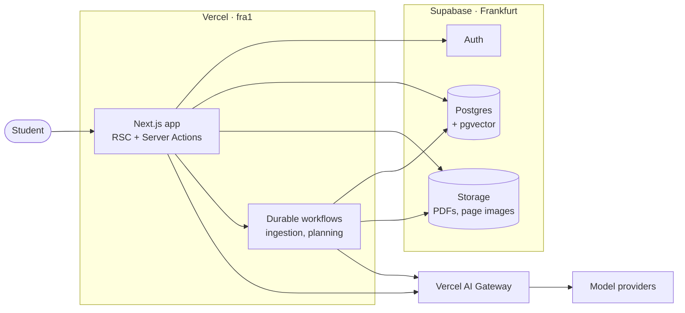

# Architecture

How Project Mastery is built and why. [VISION.md](../VISION.md) defines what the product is; this document defines the technical choices that serve it. Most of the stack below is planned and lands with the features that need it. The README lists what is in place today.

## Overview

## Stack

| Area                     | Choice                                                                    |
| ------------------------ | ------------------------------------------------------------------------- |
| Framework                | Next.js (App Router, React Server Components, Server Actions), TypeScript |
| Validation               | Zod (inputs, environment variables, structured AI output)                 |
| UI                       | Tailwind CSS, shadcn/ui, AI Elements, own design tokens                   |
| Math and documents       | KaTeX, Streamdown (streaming markdown with math), react-pdf               |
| Database, auth, storage  | Supabase: Postgres with pgvector, Auth, Storage, Row Level Security       |
| Data access              | supabase-js with generated types, SQL migrations through the Supabase CLI |
| AI                       | Vercel AI SDK through Vercel AI Gateway                                   |
| Background jobs          | Durable workflows: Vercel Workflow, to be confirmed against Inngest       |
| Spaced repetition        | FSRS (`ts-fsrs`)                                                          |
| LLM tracing and evals    | Langfuse                                                                  |
| Errors, analytics, email | Sentry, PostHog, Resend                                                   |
| Hosting                  | Vercel (functions in `fra1`), Supabase (Frankfurt)                        |

## Environments

| Environment | App                         | Supabase               | AI                                |
| ----------- | --------------------------- | ---------------------- | --------------------------------- |
| Local       | `pnpm dev`                  | Supabase CLI in Docker | AI Gateway, free monthly credit   |
| Tests / CI  | Vitest, Playwright          | Supabase CLI in Docker | AI SDK mock models, no real calls |
| Preview     | Vercel preview per PR       | Staging project        | AI Gateway, free monthly credit   |
| Production  | Vercel production on `main` | Production project     | AI Gateway, purchased credits     |

Preview deployments never touch production data.

## Decisions

Each decision records the context, the choice and its consequences. A decision changes through a PR that updates its entry.

### 1. Hosted only, no self-hosted version

**Context.** A local version for end users would need users to bring their own API keys, a second auth and storage path, and its own documentation and tests. VISION.md requires accounts, usage metering and limits from the start, and AI cost is the main cost driver, so the product assumes one system that we operate. Non-technical students would not clone a repository, and local models are not good enough for math tutoring.

**Decision.** Ship one hosted product. Make local development excellent instead: cloning the repository and running Supabase locally starts the full stack.

**Consequences.** One code path for auth, storage and AI. Self-hosting can be reconsidered if a real need appears.

### 2. Supabase as the backend platform

**Context.** The app needs Postgres, authentication, file storage for several PDFs per user, and vector search for grounded answers. Running separate services for each adds accounts, configuration and failure modes for a small team.

**Decision.** Use Supabase for Postgres (with pgvector), Auth and Storage.

**Consequences.** One platform, one local emulator, one permission model for rows and files. The free plan has 1 GB of file storage, a 50 MB upload limit, and pauses projects after 7 days without activity, so the public demo needs a scheduled keep-alive and real usage needs the Pro plan.

### 3. supabase-js with Row Level Security instead of an ORM

**Context.** An ORM such as Drizzle connects with a database role that bypasses Row Level Security, so access control would live in application code. supabase-js calls run as the signed-in user, so Postgres enforces it.

**Decision.** Access data through supabase-js with types generated from the schema. Write schema changes as SQL migrations with the Supabase CLI. Row Level Security policies are the security boundary for both tables and stored files.

**Consequences.** Every table needs policies, and tests cover them. Server-only code that must bypass policies (for example background jobs) uses the service role deliberately and in few places.

### 4. EU region

**Context.** The first users are university students in the EU, and course materials and learning data are personal data under the GDPR.

**Decision.** Host Supabase in Frankfurt and run Vercel functions in `fra1`, next to the database. Vercel's default region is in the US, so the region is set explicitly in `vercel.json`.

**Consequences.** Low latency between app and database, and personal data stored in the EU. Production AI requests must go to providers that do not train on or retain the data (see decision 6).

### 5. Vercel AI SDK through Vercel AI Gateway

**Context.** The app uses several models for different tasks, and the right model per task will change as models improve. Switching providers should be a configuration change.

**Decision.** Call models through the Vercel AI SDK and route requests through Vercel AI Gateway. Model choice lives in one per-task configuration (for example `tutor`, `ingest`, `embed`), not in feature code. No additional agent framework.

**Consequences.** One API key and one bill for every provider, no token markup, fallbacks and spend tracking in one place. The AI SDK covers streaming chat UIs, structured output with Zod, tool calling and mock models for tests. Each task uses the smallest model that does it well, as VISION.md requires.

### 6. AI cost: near zero in development, metered in production

**Context.** There are no users yet, so development should cost nothing or close to it. AI Gateway gives every team a free monthly credit on a subset of models, with lower rate limits. Bring-your-own-key requires the paid tier, and buying credits ends the free credit for good.

**Decision.** Develop on the free credit with free-tier models. Unit tests and CI use mock models and make no real calls. Production moves to purchased credits, with budgets per project and API key. Before real users, production tasks are restricted to providers with zero data retention and no training on prompts.

**Consequences.** Development code must handle `429` responses from the free tier's rate limits, which long-running jobs need anyway. Every AI call retries with backoff (AI SDK `maxRetries`, honoring `retry-after`), and AI Gateway falls back to the next model configured for the task. Token usage and cost are recorded per user and per AI call from the first AI feature, which also provides the metering VISION.md requires.

### 7. Ingestion: process every upload once

**Context.** Grounded answers need citations down to the slide or page. Course PDFs in STEM are full of formulas, diagrams and scanned exams, which plain text extraction loses. Not every model accepts PDF files directly, but most current models accept images.

**Decision.** Ingest each upload once in a background workflow: render each page to an image, convert it with a vision model to markdown with LaTeX, split it into chunks that keep their page reference, embed the chunks into pgvector, and derive the topic map. Every feature reuses this result.

**Consequences.** Works with any vision model, so the ingestion model can change freely. Ingestion cost is paid once per upload, not per question. The exact conversion model is chosen by testing on real course materials.

### 8. Workflows by default, agents where they pay off

**Context.** Most of the product (ingestion, exam analysis, plan building, review scheduling) is a known sequence of steps. Autonomous agent loops cost more and behave less predictably.

**Decision.** Build fixed pipelines with LLM steps by default. Use agent loops with tools where the path cannot be known in advance, mainly the tutor session (looking up course material, recording mastery, scheduling reviews).

**Consequences.** Lower and more predictable cost per student, and steps that can be tested on their own.

### 9. Durable background jobs

**Context.** Ingestion and planning take minutes and must survive timeouts and failed model calls. A single serverless request is not enough.

**Decision.** Run long tasks as durable workflows with retries per step. Vercel Workflow is the first candidate because it runs on the existing platform; Inngest is the alternative. A short spike on the first ingestion feature confirms the choice.

**Consequences.** Jobs report progress through the database, so the UI can show it. Vercel Workflow is set up with an example workflow in `src/workflows/`; the comparison with Inngest still happens on the first ingestion feature.

### 10. Learning science as libraries, not inventions

**Context.** Spaced retrieval is central to VISION.md, and scheduling algorithms are a solved problem.

**Decision.** Schedule reviews with FSRS through `ts-fsrs`.

**Consequences.** Review scheduling rests on a well-studied algorithm, and the app's own work goes into deciding what to review and how to ask.

### 11. UI built on shadcn/ui with its own design

**Context.** The app should look professional and distinct. shadcn/ui gives accessible, consistent components that the codebase owns, but its defaults look like every other shadcn app.

**Decision.** Build on shadcn/ui and AI Elements for chat, with the project's own design tokens for typography, color, dark mode and motion. Render math with KaTeX and stream AI answers with Streamdown. Show cited pages in a PDF viewer that jumps to the page.

**Consequences.** A small design direction is set before the first feature screens, so every screen follows it.

shadcn/ui uses Radix primitives, which AI Elements builds on. The design tokens live in `src/app/globals.css` in three layers (palette inputs, semantic tokens per color mode, Tailwind theme), so the design direction changes values in one place; until it is decided they hold neutral placeholders. Dark mode follows the system by default through `next-themes`. AI answers render through one `Markdown` component (Streamdown with KaTeX, `$…$` and `$$…$$` as math), and the PDF viewer loads only in the browser.

### 12. Observability and quality of AI behavior

**Context.** The tutor's most important behavior is pedagogical: asking before telling, grounding answers in the course. A tutor that starts handing out solutions breaks the first principle of VISION.md, and no unit test catches that.

**Decision.** Trace every AI call with Langfuse and keep evaluation datasets for key prompts, run on demand and before prompt or model changes. Report errors to Sentry, product analytics to PostHog, and send auth emails through Resend, since Supabase's built-in email is only meant for testing.

**Consequences.** Prompt and model changes are checked against evals like code changes are checked against tests.

### 13. Hosting plans

**Context.** Vercel's Hobby plan is free but limited to non-commercial use. Supabase's free plan allows two projects.

**Decision.** Stay on free plans while there are no paying users: one Supabase project for staging and previews, one for production.

**Consequences.** Charging money requires Vercel Pro, and real usage requires Supabase Pro. Both are expected costs in the business model.

## Open questions

- Durable workflow engine: Vercel Workflow (set up) or Inngest (decision 9).
- Models for ingestion, tutoring and embeddings, chosen by testing on real course materials.
- Design direction: typography, color and motion.
